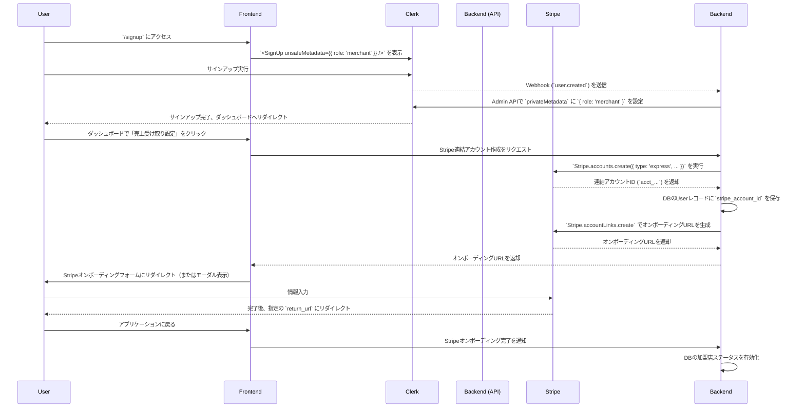
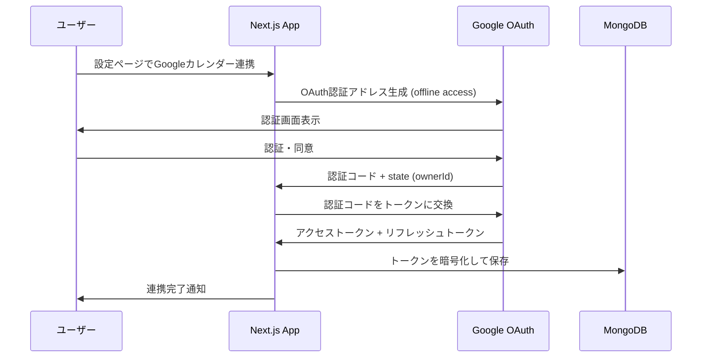
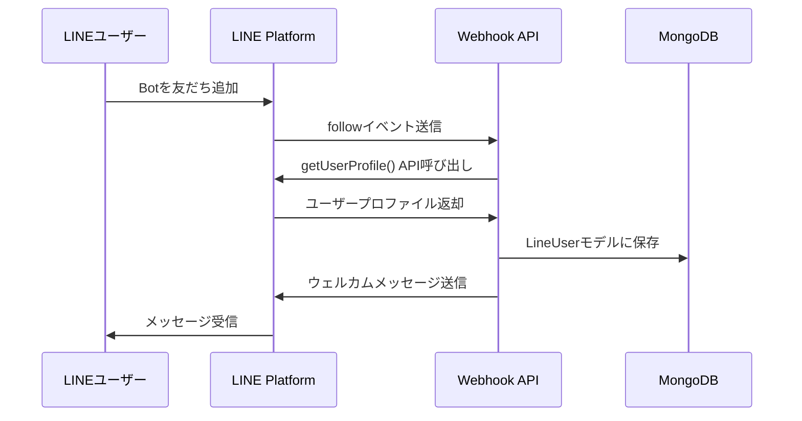
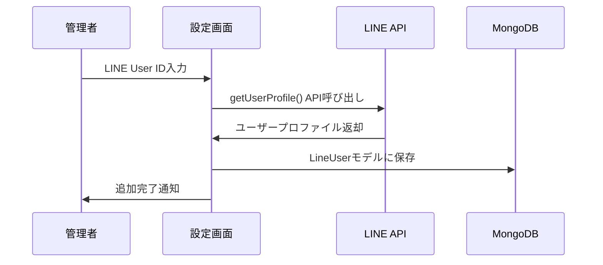

# Multi-Tenant Calendar & LINE Messaging System

Next.js 15、Clerk認証、MongoDB/Mongoose、Googleカレンダー、LINE Messaging APIを統合したマルチテナント対応のカレンダー管理システムです。

## 主な機能

- 🔐 **Clerk認証** - ソーシャルログイン対応
- 📅 **Googleカレンダー連携** - リフレッシュトークン自動管理
- 💬 **LINE Messaging API** - メッセージ送信機能
- 🏢 **マルチテナント対応** - 複数のテナントがカレンダーを共有
- 🌍 **多言語対応** - 日本語、英語、フランス語

---

## E2E テスト（Clerk サインイン・トークン）

Playwright で UI を介さずに Clerk にログインし、ストレージ状態を使い回す方式を採用しています。

- テスト配置: `e2e/`
- 設定: `playwright.config.ts`（`globalSetup` でサインイン・トークンを利用したログインを実行）
- ストレージ状態: `tmp/playwright/state/auth.json`

### 事前準備（あなたがやること）

1) Clerk でテストユーザーを作成し、そのユーザーの ID を控える（2FA は無効推奨）。

2) 環境変数を準備（ローカル実行時の例）
```bash
export CLERK_SECRET_KEY=sk_...            # Clerk 管理APIキー（機密）
export CLERK_TEST_USER_ID=user_...        # 1) で控えたユーザーID
export E2E_BASE_URL=http://localhost:3000 # このアプリは dev で 3000 ポート
# 任意: export E2E_LOCALE=ja             # 既定は 'en'
```

3) Playwright をインストール
```bash
pnpm add -D @playwright/test
pnpm exec playwright install
```

4) アプリを起動（別ターミナル）
```bash
pnpm dev  # http://localhost:3000
```

5) E2E テストを実行
```bash
pnpm test:e2e
# headed で動かす場合
pnpm test:e2e:headed
```

グローバルセットアップ（`e2e/global-setup.ts`）は Clerk 管理APIでサインイン・トークンを発行し、
`/signin?sign_in_token=...`（ロケール指定時は `/{locale}/signin?...`）へ遷移してセッションを確立、
その `storageState` を `tmp/playwright/state/auth.json` に保存します。各テストはこの状態を再利用します。

CI でも同様に、`CLERK_SECRET_KEY` と `CLERK_TEST_USER_ID` をシークレットとして注入してください。

---

## アポハブ ユーザー登録およびオンボーディングフロー仕様

従来のユーザー登録・オンボーディングフローに加えて、新しくGoogleカレンダー連携とLINE Messaging機能を追加しました。

---

### 1. 概要

本プラットフォームは、認証に **Clerk** を、決済および加盟店の売上管理に **Stripe Connect (Express Account)** を利用します。
ユーザーは「加盟店 (Merchant)」と「買い手 (Customer)」の2つの役割に明確に分離され、登録を開始したURLの文脈に応じて、それぞれに最適化されたフローを提供します。

#### 2. ユーザー役割 (User Roles)

-   **`merchant` (加盟店):** 自身のサービスをプラットフォーム上に掲載し、予約を受け付け、売上金を受け取るユーザー。Stripe連結アカウントの作成が必須。
-   **`customer` (買い手):** プラットフォーム上のサービスを検索・予約し、代金を支払うユーザー。

#### 3. 役割管理のコアコンセプト

ユーザーの役割 (Role) は、Clerkの **`privateMetadata`** に保存し、サーバーサイドでのみ管理することでセキュリティを担保します。

1.  **役割の意図を通知:** ユーザーが登録を開始したURLに応じて役割の「意図」を決定し、Clerkの `unsafeMetadata` を利用して渡します。
    -   **加盟店:** `apohub.jp/signup` から登録 → `{ role: 'merchant' }`
    -   **買い手:** `apohub.jp/merchants/{merchant_id}/signup` 等から登録 → `{ role: 'customer' }`
2.  **役割の確定:** Clerkの `user.created` Webhookをトリガーに、サーバーサイドのAPIが起動します。APIは `unsafeMetadata` を検証し、安全な `privateMetadata` に正式な役割を書き込みます。

---

#### 4. 加盟店 (Merchant) 登録フロー

###### 4.1. ユーザー体験 (UX)

1.  トップページ等の「サービスを掲載する」ボタンをクリックし、加盟店登録ページ (`/signup`) にアクセスします。
2.  ClerkのUIでメールアドレス/パスワード等を入力し、アカウントを作成します。
3.  登録が完了すると、加盟店向けダッシュボードにリダイレクトされます。
4.  ダッシュボード上の案内に従い、「売上受け取り設定」を開始します。
5.  サイト内でStripeのオンボーディングフォームが表示され、事業者情報・本人確認情報・銀行口座情報を入力します。
6.  入力が完了すると、ダッシュボードに戻り、すべての設定が完了したことが通知されます。

###### 4.2. システムシーケンス



#### 5. 買い手 (Customer) 登録フロー

##### 5.1. ユーザー体験 (UX)

1.  特定の加盟店ページ (`/merchants/{merchant_id}`) を訪れ、「予約する」や「新規登録」ボタンをクリックします。
2.  加盟店ごとの登録ページ (`/merchants/{merchant_id}/signup`)、または予約フローの途中でClerkのログイン/新規登録UIが表示されます。
3.  ClerkのUIでアカウントを作成・ログインします。
4.  登録完了後、シームレスに元の加盟店ページや予約フローに復帰します。

##### 5.2. システムシーケンス

```mermaid
sequenceDiagram
    participant User
    participant Frontend
    participant Clerk
    participant Backend (API)
    participant Stripe

    User->>Frontend: `/merchants/{merchant_id}/signup` 等の買い手登録UIにアクセス
    Frontend->>Clerk: `<SignUp unsafeMetadata={{ role: 'customer' }} />` を表示
    User->>Clerk: サインアップ実行
    Clerk-->>Backend: Webhook (`user.created`) を送信
    Backend->>Clerk: Admin APIで `privateMetadata` に `{ role: 'customer' }` を設定
    Backend->>Stripe: (推奨) `Stripe.customers.create` を実行
    Stripe-->>Backend: Stripe顧客ID (`cus_...`) を返却
    Backend->>Backend: DBのUserレコードに `stripe_customer_id` を保存
    Clerk-->>User: サインアップ完了、元のページやマイページにリダイレクト

---

## アーキテクチャ概要

### データベース設計

```
┌─────────────────┐    ┌─────────────────┐    ┌─────────────────┐
│   Tenant        │    │   Calendar      │    │ TenantCalendar  │
├─────────────────┤    ├─────────────────┤    ├─────────────────┤
│ _id             │    │ _id             │    │ tenantId        │
│ name            │    │ googleCalendarId│◄───┤ calendarId      │
│ ownerId         │    │ name            │    │ role            │
│ googleCalendarId│    │ ownerId         │    │ canBook         │
└─────────────────┘    │ isPublic        │    │ customSettings  │
                       └─────────────────┘    │ isActive        │
                                              └─────────────────┘

┌─────────────────┐    ┌─────────────────┐    ┌─────────────────┐
│  GoogleToken    │    │LineMessagingCfg │    │   LineUser      │
├─────────────────┤    ├─────────────────┤    ├─────────────────┤
│ ownerId         │    │ ownerId         │    │ ownerId         │
│ accessToken     │    │ channelAccessTkn│    │ lineUserId      │
│ refreshToken    │    │ channelSecret   │    │ displayName     │
│ expiryDate      │    │ channelId       │    │ isFollowing     │
└─────────────────┘    └─────────────────┘    └─────────────────┘
```

---

## Googleカレンダー連携実装フロー

### 1. 設定準備

#### Google Cloud Console設定
```bash
1. Google Cloud Consoleでプロジェクト作成
2. Calendar APIを有効化
3. OAuth 2.0クライアントIDを作成
   - アプリケーションタイプ: ウェブアプリケーション
   - 承認済みリダイレクトURI: http://localhost:3000/api/auth/google/callback
4. スコープ設定:
   - https://www.googleapis.com/auth/calendar.readonly
   - https://www.googleapis.com/auth/calendar.events.readonly
```

#### 環境変数設定
```bash
# .env.local
GOOGLE_CLIENT_ID=your_google_client_id
GOOGLE_CLIENT_SECRET=your_google_client_secret
GOOGLE_REDIRECT_URI=http://localhost:3000/api/auth/google/callback
```

### 2. OAuth認証フロー



### 3. トークン管理実装

#### OAuth認証設定 (`lib/oauth-token-manager.ts`)
```typescript
// access_type: 'offline' でリフレッシュトークンを取得
generateAuthUrl(ownerId: string): string {
  return this.oauth2Client.generateAuthUrl({
    access_type: 'offline',  // 重要: リフレッシュトークン取得
    scope: [
      'https://www.googleapis.com/auth/calendar.readonly',
      'https://www.googleapis.com/auth/calendar.events.readonly'
    ],
    state: ownerId,
    prompt: 'consent',  // 常に同意画面を表示してリフレッシュトークン確保
  });
}
```

#### 自動トークンリフレッシュ (`services/calendar-service.ts`)
```typescript
private static async getCalendarOwnerToken(ownerId: string): Promise<string | null> {
  const googleToken = await GoogleToken.findOne({ ownerId });
  
  if (!googleToken) return null;

  // 有効期限の5分前にリフレッシュ
  const now = new Date();
  const expiryDate = new Date(googleToken.expiryDate);
  const shouldRefresh = expiryDate.getTime() - now.getTime() < 5 * 60 * 1000;

  if (shouldRefresh) {
    try {
      const newTokens = await tokenManager.refreshAccessToken(googleToken.refreshToken);
      
      // データベースを更新
      await GoogleToken.findByIdAndUpdate(googleToken._id, {
        accessToken: newTokens.accessToken,
        refreshToken: newTokens.refreshToken,
        expiryDate: new Date(newTokens.expiryDate),
      });

      return newTokens.accessToken;
    } catch (error) {
      // リフレッシュ失敗時はトークンを削除
      await GoogleToken.findByIdAndDelete(googleToken._id);
      return null;
    }
  }

  return googleToken.accessToken;
}
```

### 4. APIエンドポイント使用例

#### カレンダー情報取得
```bash
GET /api/calendars/[calendarId]?tenantId=tenant123
```

#### カレンダーイベント取得
```bash
GET /api/calendars/[calendarId]/events?tenantId=tenant123&timeMin=2024-01-01T00:00:00Z
```

#### 空き時間取得
```bash
GET /api/calendars/[calendarId]/availability?tenantId=tenant123&date=2024-01-15&duration=60
```

---

## LINE Messaging API連携実装フロー

### 1. 設定準備

#### LINE Developers Console設定
```bash
1. LINE Developersでプロバイダー作成
2. Messaging APIチャンネル作成
3. 以下の情報を取得:
   - チャンネルID
   - チャンネルシークレット
   - チャンネルアクセストークン (長期)
4. Webhook設定 (オプション):
   - https://yourdomain.com/api/line/webhook
```

#### Clerk設定 (ソーシャルログイン用)
```bash
1. Clerkダッシュボード > Social Connections
2. LINEを有効化
3. カスタム認証情報を設定 (LINE Login Channel用)
```

### 2. LINE User ID取得フロー

#### 方法1: Webhook経由（推奨）


#### 方法2: 手動追加


### 3. Webhook実装詳細

#### イベント処理 (`api/line/webhook/route.ts`)
```typescript
// フォローイベント処理
async function handleFollowEvent(event: FollowEvent, ownerId: string, lineService: LineMessagingService) {
  // ユーザープロファイルを取得
  const profile = await lineService.getUserProfile(event.source.userId);
  
  // データベースに保存
  await LineUser.findOneAndUpdate(
    { ownerId, lineUserId: event.source.userId },
    {
      displayName: profile.displayName,
      pictureUrl: profile.pictureUrl,
      statusMessage: profile.statusMessage,
      isFollowing: true,
      followedAt: new Date(),
    },
    { upsert: true }
  );
  
  // ウェルカムメッセージ送信
  await lineService.pushMessage(event.source.userId, [{
    type: 'text',
    text: `${profile.displayName}さん、友だち追加ありがとうございます！🎉`,
  }]);
}
```

### 4. メッセージ送信実装

#### 基本的なメッセージ送信
```typescript
// POST /api/line/messages/send
{
  "to": "U1234567890abcdef1234567890abcdef",
  "type": "push",
  "messages": [{
    "type": "text",
    "text": "こんにちは！"
  }]
}
```

#### 複数ユーザーへの送信
```typescript
{
  "to": ["Uxxxx", "Uyyyy", "Uzzzz"],
  "type": "multicast",
  "messages": [{
    "type": "text",
    "text": "重要なお知らせです"
  }]
}
```

#### 全友だちへの送信
```typescript
{
  "type": "broadcast",
  "messages": [{
    "type": "text",
    "text": "メンテナンスのお知らせ"
  }]
}
```

#### リッチメッセージの例
```typescript
// ボタンテンプレート
{
  "to": "Uxxxx",
  "type": "push",
  "messages": [{
    "type": "template",
    "altText": "予約確認",
    "template": {
      "type": "buttons",
      "title": "予約確認",
      "text": "明日の予約はいかがですか？",
      "actions": [
        {
          "type": "message",
          "label": "確定",
          "text": "予約を確定します"
        },
        {
          "type": "message",
          "label": "キャンセル",
          "text": "予約をキャンセルします"
        }
      ]
    }
  }]
}
```

### 5. LINE User管理画面

設定ページでは以下の機能が利用できます：

1. **自動ユーザー管理**: Webhookで友だち追加時に自動登録
2. **手動ユーザー追加**: LINE User IDを直接入力
3. **ユーザーリスト表示**: フォロワー一覧とプロファイル情報
4. **テストメッセージ送信**: 個別ユーザーへのテスト送信

---

## 開発・デプロイガイド

### 開発環境セットアップ

```bash
# 1. リポジトリクローン
git clone <repository-url>
cd <project-directory>

# 2. 依存関係インストール
pnpm install

# 3. 環境変数設定
cp .env.example .env.local
# .env.localを編集して各種認証情報を設定

# 4. MongoDB起動 (ローカル開発時)
# Docker使用の場合:
docker run -d -p 27017:27017 --name mongodb mongo:latest

# 5. 開発サーバー起動
pnpm dev
```

### 本番環境デプロイ

1. **MongoDB Atlas設定**
2. **Vercel環境変数設定**
3. **Google OAuth本番設定**
4. **LINE Webhook URL設定**
5. **ドメイン設定とSSL証明書**

### トラブルシューティング

#### Googleカレンダー連携
- リフレッシュトークンが取得できない → `prompt: 'consent'` を確認
- トークンが期限切れ → 自動リフレッシュロジックを確認

#### LINE連携
- Webhook応答しない → 署名検証を確認
- ユーザーIDが取得できない → Bot友だち追加状況を確認

---

## ライセンス

MIT License
