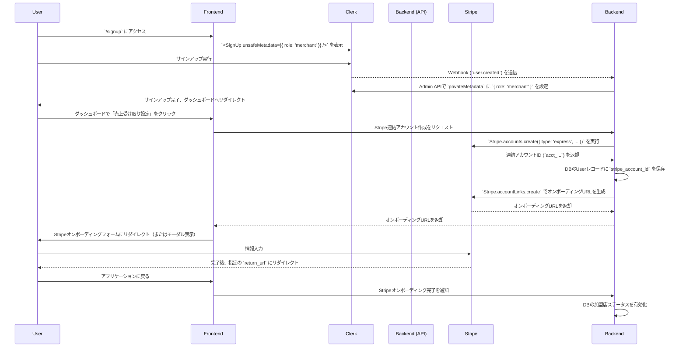

# アポハブ

## アポハブ ユーザー登録およびオンボーディングフロー仕様

このドキュメントは、本プラットフォームにおけるユーザー登録およびオンボーディングのフローを定義します。

---

### 1. 概要

本プラットフォームは、認証に **Clerk** を、決済および加盟店の売上管理に **Stripe Connect (Express Account)** を利用します。
ユーザーは「加盟店 (Merchant)」と「買い手 (Customer)」の2つの役割に明確に分離され、登録を開始したURLの文脈に応じて、それぞれに最適化されたフローを提供します。

#### 2. ユーザー役割 (User Roles)

-   **`merchant` (加盟店):** 自身のサービスをプラットフォーム上に掲載し、予約を受け付け、売上金を受け取るユーザー。Stripe連結アカウントの作成が必須。
-   **`customer` (買い手):** プラットフォーム上のサービスを検索・予約し、代金を支払うユーザー。

#### 3. 役割管理のコアコンセプト

ユーザーの役割 (Role) は、Clerkの **`privateMetadata`** に保存し、サーバーサイドでのみ管理することでセキュリティを担保します。

1.  **役割の意図を通知:** ユーザーが登録を開始したURLに応じて役割の「意図」を決定し、Clerkの `unsafeMetadata` を利用して渡します。
    -   **加盟店:** `apohub.jp/signup` から登録 → `{ role: 'merchant' }`
    -   **買い手:** `apohub.jp/merchants/{merchant_id}/signup` 等から登録 → `{ role: 'customer' }`
2.  **役割の確定:** Clerkの `user.created` Webhookをトリガーに、サーバーサイドのAPIが起動します。APIは `unsafeMetadata` を検証し、安全な `privateMetadata` に正式な役割を書き込みます。

---

#### 4. 加盟店 (Merchant) 登録フロー

###### 4.1. ユーザー体験 (UX)

1.  トップページ等の「サービスを掲載する」ボタンをクリックし、加盟店登録ページ (`/signup`) にアクセスします。
2.  ClerkのUIでメールアドレス/パスワード等を入力し、アカウントを作成します。
3.  登録が完了すると、加盟店向けダッシュボードにリダイレクトされます。
4.  ダッシュボード上の案内に従い、「売上受け取り設定」を開始します。
5.  サイト内でStripeのオンボーディングフォームが表示され、事業者情報・本人確認情報・銀行口座情報を入力します。
6.  入力が完了すると、ダッシュボードに戻り、すべての設定が完了したことが通知されます。

###### 4.2. システムシーケンス



#### 5. 買い手 (Customer) 登録フロー

##### 5.1. ユーザー体験 (UX)

1.  特定の加盟店ページ (`/merchants/{merchant_id}`) を訪れ、「予約する」や「新規登録」ボタンをクリックします。
2.  加盟店ごとの登録ページ (`/merchants/{merchant_id}/signup`)、または予約フローの途中でClerkのログイン/新規登録UIが表示されます。
3.  ClerkのUIでアカウントを作成・ログインします。
4.  登録完了後、シームレスに元の加盟店ページや予約フローに復帰します。

##### 5.2. システムシーケンス

```mermaid
sequenceDiagram
    participant User
    participant Frontend
    participant Clerk
    participant Backend (API)
    participant Stripe

    User->>Frontend: `/merchants/{merchant_id}/signup` 等の買い手登録UIにアクセス
    Frontend->>Clerk: `<SignUp unsafeMetadata={{ role: 'customer' }} />` を表示
    User->>Clerk: サインアップ実行
    Clerk-->>Backend: Webhook (`user.created`) を送信
    Backend->>Clerk: Admin APIで `privateMetadata` に `{ role: 'customer' }` を設定
    Backend->>Stripe: (推奨) `Stripe.customers.create` を実行
    Stripe-->>Backend: Stripe顧客ID (`cus_...`) を返却
    Backend->>Backend: DBのUserレコードに `stripe_customer_id` を保存
    Clerk-->>User: サインアップ完了、元のページやマイページにリダイレクト